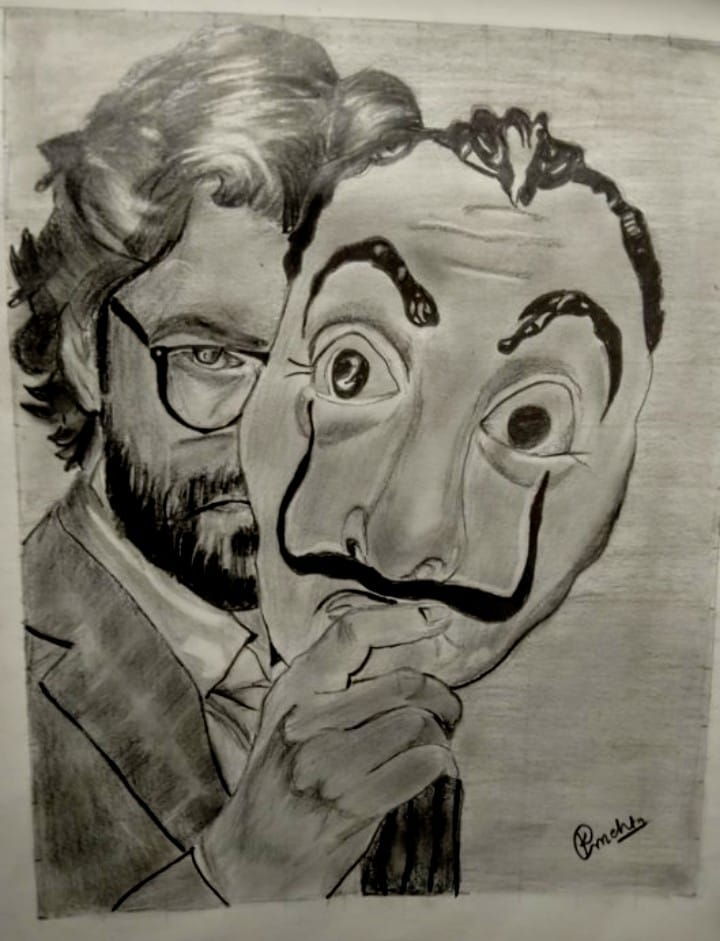
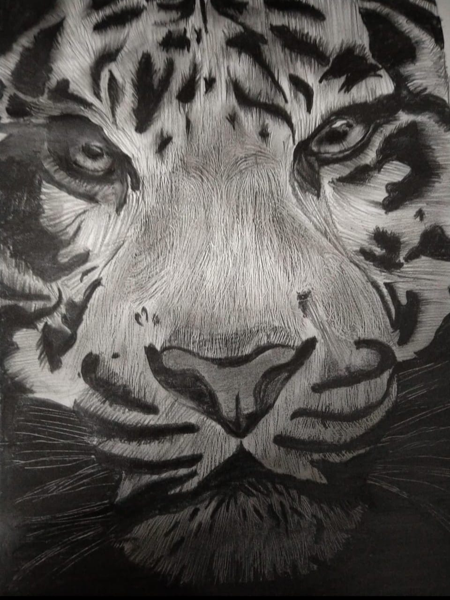

# 🎨 Krupa Sketchbook

A digital sketchbook showcasing my creative journey through art, illustrations, and design explorations. This portfolio is a space where traditional creativity meets modern web design, allowing visitors to browse my artwork in an immersive and minimal experience.

🌐 **Live Website:** https://krupa-sketchbook-hu8849gd3-krupam26s-projects.vercel.app/

---

## ✨ About

Krupa Sketchbook is a personal art portfolio built to present my sketches and creative work in a clean, distraction-free interface. Rather than simply displaying images, the website tells the story behind my artistic journey through a modern and responsive web experience.

Whether it's pencil sketches, digital illustrations, or experimental artwork, every piece reflects my passion for creativity and design.

---

## 🚀 Features

- 🖼️ Clean and minimal gallery layout
- 📱 Fully responsive design
- 🎨 Modern aesthetic inspired by sketchbooks
- ⚡ Fast loading and optimized performance
- 🔍 Individual artwork showcase
- 🌙 Smooth user experience
- ✨ Elegant animations and transitions

---

## 🛠️ Tech Stack

### Frontend
- HTML5
- CSS3
- Three.js 

### Deployment
- Vercel

---

## 📂 Project Structure

```
├── index.html
├── public/
│   ├── images
└── README.md
```

---

## 💻 Installation

Clone the repository

```bash
git clone https://github.com/yourusername/krupa-sketchbook.git
```

Navigate into the project

```bash
cd krupa-sketchbook
```

Install dependencies

```bash
npm install
```

Run the development server

```bash
npm run dev
```

Open

```
http://localhost:3000
```

---

## 🎯 Purpose

This project was created to:

- Showcase my artwork professionally
- Build an online creative portfolio
- Experiment with modern web technologies
- Combine UI/UX design with artistic storytelling

---

## 📸 Preview







## 👩‍🎨 About Me

Hi! I'm **Krupa Mehta** — an engineering student, UI/UX designer, artist, and creative problem solver.

I enjoy blending technology with creativity, whether through digital products, illustrations, or innovative design concepts.

---

## 📬 Connect With Me

LinkedIn:
https://www.linkedin.com/in/krupa-mehta2602/

Email:
krupamehta2007@gmail.com

---

## ⭐ If you like this project...

Consider giving it a ⭐ on GitHub!

---

Made with ❤️ by **Krupa Mehta**
